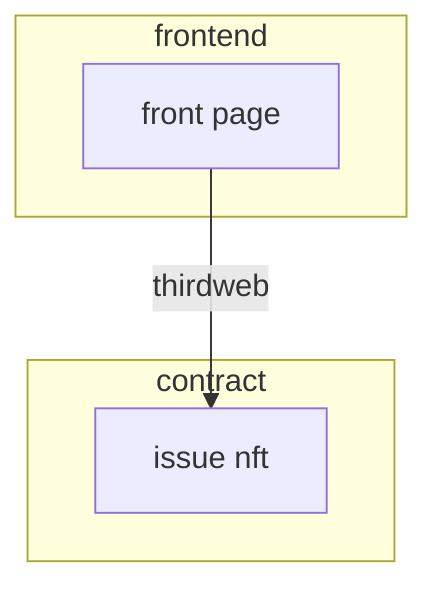

# nft-image-processor

Processes uploaded images to make them suitable for NFT conversion.

## Architecture

```mermaid
graph TD

  subgraph frontend
    A[front page]
  end

  subgraph contract
    B[issue nft]
  end

  A -->|"thirdweb"| B
```
