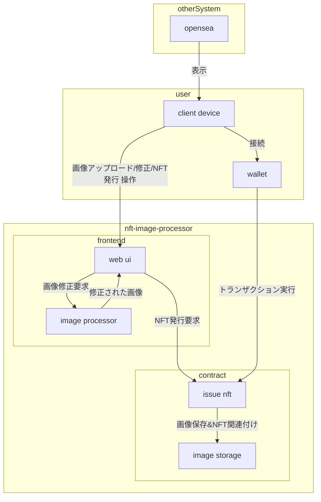

# nft-image-processor

アップロードした画像からフルオンチェーン NFT を発行できます。

## Features

- ユーザーはアプリケーションから画像をアップロードできる
- ユーザーは画像をフルオンチェーン NFT 用の画像に修正できる
- ユーザーはフルオンチェーン NFT を自分のウォレットに対して発行できる

## System Diagram

```mermaid
graph TD
  subgraph user
    A[client device]
    B[wallet]
  end

  subgraph nft-image-processor
    subgraph frontend
      C[web ui]
      D[image processor]
    end

    subgraph contract
      E[issue nft]
      F[image storage]
    end
  end

  subgraph otherSystem
    G[opensea]
  end

  A -->|接続| B
  A --->|画像アップロード/修正/NFT発行 操作| C
  C -->|画像修正要求| D
  D -->|修正された画像| C
  C --->|NFT発行要求| E
  B --->|トランザクション実行| E
  E -->|画像保存&NFT関連付け| F
  G -->|表示| A
```
